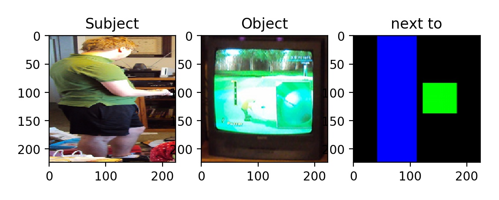
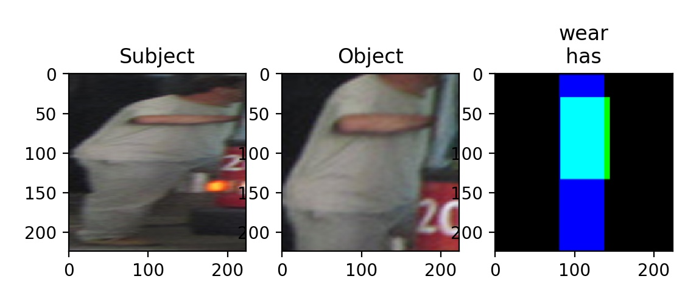

# CV_Multi_Relation_Classification

### Main Task


- **INPUT** : Subject bounding box 와 Object bounding box 정보가 포함된 한 장의 이미지
- **OUTPUT** : Predicate class 70개에 대한 예측 vector ( 각 value 범위 : [0, 1] )


### Dataset

- **VRD (Visual Relationship Detection dataset)**

  - Download : https://drive.google.com/file/d/1vPncv8A5m1P_iMFrhdzeANZSSgLtcpSc/view?usp=sharing 

  - *Images* :

    - Train (train_images) : 2999개

      ( `002424.jpg` 가 존재하지 않음 ) 

    - Validation (val_images) : 1000개 

    - Test (test_images) : 1000개 

  - *Relation Annotation* :

    

    ```python
    {...
    FILENAME: [...
    	{'subject': {'category': CATEGORY_ID, 'bbox': [XMIN, YMIN, XMAX, YMAX]},
    	 'predicate': [PREDICATE_ID, ...],
    	 'object': {'category': CATEGORY_ID, 'bbox': [XMIN, YMIN, XMAX, YMAX]},
    	}
    	...]
    ...}
    ```

    - Object Class ID : 0~99
    - Predicate Class ID : 0~69
    - Training Data : 20225개 (즉, 1개 train_image 당 평균 20225/2999 ≈ 7개 Relation pair가 있음)


### Models

#### CNN을 사용하지 않은 구조 ( `model_ver: 1` )

- `predicates.json` 파일 안에 있는 여러 predicate class들을 보았을 때, 방향과 관련있는 predicate들이 대다수였다 (next to，under，on the top of，on the right of 등등). 그래서 Subject bounding box에서 Object bounding box 까지의 방향이 중요한 feature중 하나라 생각했다.
- 방향과 더불어 Subject와 Object의 크기와 관련있는 predicate들도 많이 찾아볼 수 있었다(taller than, skate on, hold, wear 등등). 모든 이미지들의 scale이 모두 다른점을 고려해서 scale에 독립적인  Subject와 Object의 비율과 면적 정보도 중요한 feature라고 생각했다.

##### [데이터 전처리]


- ***Histogram feature*** : 

  한 이미지에서 각 Subject와 Object의 Bounding box 내 영역의 RGB Color Histogram과 Gradient Histogram를 계산한다. (`cv2.calcHist()` , `skimage.hog()` 사용)

- ***Direction feature*** : 

  

  One-hot encode 형식의 feature array이며 array의 각 index는 나침반의 16개 방향 (N, NNE, NE, ENE, E 등...)을 의미한다. 한 이미지에서 Subject bounding box의 중심을 기준으로 Object bounding box 중심까지의 방향을 계산하여 대응하는 index의 값이 1이 된다.

- ***Bounding box Ratio & Area feature*** :

  본 Feature array의 앞에 7개 index는 One-hot encode 형식이며 Subject와 object의 bounding box 가로,세로 길이의 비율을 나타낸다. 앞에 7개 index값이 1이되는 기준은 다음 조건을 만족 할 경우 설정된다 :

  Index[0] :  `Subject bbox의 x축 길이 > Subject bbox의 y축 길이*2` 

  Index[1] :  `Subject bbox의 y축 길이*2 > Subject bbox의 x축 길이 > Subject bbox의 y축 길이  ` 

  Index[2] :  `Subject bbox의 x축 길이*2 > Subject bbox의 y축 길이 > Subject bbox의 x축 길이  ` 

  Index[3] :  `Subject bbox의 y축 길이 > Subject bbox의 x축 길이*2` 

  Index[4] :  `Object bbox의 x축 길이 > Object bbox의 y축 길이*2` 

  Index[5] :  `Object bbox의 y축 길이*2 > Object bbox의 x축 길이 > Object bbox의 y축 길이  ` 

  Index[6] :  `Object bbox의 x축 길이*2 > Object bbox의 y축 길이 > Object bbox의 x축 길이  ` 

  Index[7] :  `Object bbox의 y축 길이 > Object bbox의 x축 길이*2` 

  Feature array의 마지막 index는 `Subject bbox의 면적 / Object bbox의 면적`  값이다.

  

##### [모델 구조]


- Weight & Bias 초기값 설정 :

  ```python
  if isinstance(m, nn.Linear):
  	nn.init.kaiming_uniform_(m.weight.data)
  	nn.init.constant_(m.bias.data, 0)
  ```

- Hidden Layer Node 개수 설정 :

  ```python
  input_feature = 2211
  output_classes = 70
  hidden_nodes = int((input_feature + output_classes) * (2/3))
  ```

- Loss Function 설정 : `torch.nn.BCELoss()`

- Optimizer 설정 : `torch.optim.SGD()`

  - 훈련 중 learning rate 조정

    ```python
    lr_init = 0.1
    lr_adjust_rate = 0.01
    lr_adjust_freq = 5
    def __adjust_lr__(self, curr_epoch):
    	lr_curr = lr_init * (lr_adjust_rate ** int(curr_epoch / lr_adjust_freq))
    ```

    
#### CNN을 사용한 구조 ( `model_ver: 2` )

- `model_ver: 1` 를 통해 이미지에서 직접 구상한 feature들을 계산하여 추출하는 방식은 성능이 좋지못한 걸로 확인해 CNN을 활용하여 모델의 성능을 개선시켜보기로 했다.
- 모델의 전체적인 구조는 Human-Object Proposal 부분이 제외된 <a href="https://arxiv.org/pdf/1702.05448.pdf">HO-RCNN (Chao et al., 2017)</a> 의 구조를 참고하였고 Subject와 Object 이미지를 위한 CNN는 따로 훈련된 ResNet-152를 사용하기로 했다.

##### [데이터 전처리]


- 먼저 이미지에서 Subject와 Object bbox 좌표에 따라 Crop를 한 다음 각각 224 × 224 × 3 size로 resize를 하였다.

-  Interaction pattern (Subject와 Object의 관계) 를 얻기 위해서 다음 과정들이 진행된다 :

  1. 이미지에서 Subject bbox 좌표 내부의 pixel들은 1로 나머지는 모두 0으로 설정하여 Interaction pattern의 첫 번째 channel이 된다. 

  2. 이미지에서 Object bbox 좌표 내부의 pixel들은 1로 나머지는 모두 0으로 설정 Interaction pattern의 두 번째 channel이 된다. 

  3. Attention window를 찾은 다음 Interaction pattern에서 Attention window 좌표에 따라 Crop를 한다.

     - 한 전체 이미지에서 Subject bbox 와 Object bbox 관계 위치가 target으로 바로 잡힐 수 있게 Attention window을 사용한다

     - Subject bbox 와 Object bbox의 좌표를 활용하여 Attention window를 찾아낸다

       ```python
       '''
       parameter format :
           sub_region --> [xmin, ymin, xmax, ymax]
           obj_region --> [xmin, ymin, xmax, ymax]
       '''
       def find_attention_window(sub_region, obj_region):
           attention_window = []
           for idx in range(0,2):
               if sub_region[idx] < obj_region[idx]:
                   attention_window = attention_window + [sub_region[idx]]
               else:
                   attention_window = attention_window + [obj_region[idx]]
           for idx in range(2,4):
               if sub_region[idx] > obj_region[idx]:
                   attention_window = attention_window + [sub_region[idx]]
               else:
                   attention_window = attention_window + [obj_region[idx]]
           return attention_window
       ```

  4. Crop 한 Attention window 부분 안에 Subject와 Object bbox의 비율을 유지하면서 resize를 하기 위해 Attention window의 가로, 세로 길이 중 짧은 것을 긴 것과 동일하게 길이가 되도록 양쪽 side에 0으로 padding을 줘서 정사각형 형태로 만든 다음 224 × 224 × 2 size로 resize한다.

- 전처리된 이미지 데이터 Example :

  

  
  
  
  
- 모든 데이터 전처리하여 pickle를 통해 저장해둔 binary file의 용량이 전체 약 20GB정도 되서 Colab의 Standard RAM(13.6GB)으로는 훈련 진행이 불가능했다🙄

  - 그래서 AWS EC2(g4dn.4xlarge)의 힘을 빌려 진행하였다.

  

##### [모델 구조]


- `Object.js` 파일 안에 있는 여러 Object class들을 보았을 때 대다수가 ImageNet의 class들과 겹쳐서 ImageNet로 Pre-trained된 ResNet-152를 사용하여 Subject와 Object 이미지의 feature를 추출하였다. 
  - 그리고 ResNet-152의 Weight는 freeze시켜서 ( `requires_grad = False` ) 추가적으로 fine-tuning을 진행하지 않았다.
- Interaction Pattern의 Channel 수가 2개이기 때문에 ResNet-152를 사용하지 않고 별도의 Convolution과 Pooling Layer를 만들어서 feature를 추출하였다. 
  - Interaction Pattern의 feature가 이미지 전체를 함축할 수 있도록 Global Average Pooling을 추가했다 ( `nn.AdaptiveAvgPool2d(1)` ).
- Subject와 Object 이미지의 feature 그리고 Interaction Pattern의 feature까지 모두 concatenate하여 `model_ver: 1` 에서 사용하였던 Classification Layer의 입력으로 넣었다.


### Test Result

#### Metrics

* 평가지표 :  Recall@k

  * 1개의 Test data는 《Subject, Object》 으로 되어있는 한개의 쌍과 k개의 Relation class를 포함함
    * k는 고정값이 아닌 항상 1이상의 자연수임

  ***Example.*** Relation class가 [A,B,C,D,E,F,G,H,I,J] 이렇게 10개 있음

  - 어떤 한 Test sample의 label이 [1,1,1,0,0,0,0,0,0,0]일 경우, 이 Test sample의 class는 [A,B,C]，k=3
  - 이 Test sample에 대해 모델이 예측한 vector 값이 [0.9,0.8,0.1,0.0,0.0,0.0,0.5,0.2,0.0,0.0] 일 경우 가장 높게 예측한 k=3개의 Relation class은 [A,B,G]
    - 예측한 k=3개의 Relation class 중 [A,B]는 정확하게 예측을 하였음 
  - Recall@k = len([A,B]) / len([A,B,C]) = 2/3 ≈ 0.67

#### CNN을 사용하지 않은 구조 ( `model_ver: 1` ) 성능

- *Hyperparameter setting* :

  ```yaml
  model_ver:1
  
  #[training setting]
  train_split: train
  train_lr: 0.1
  train_lr_adjust_rate: 0.001
  train_lr_adjust_freq: 5
  train_epoch_num: 70
  train_save_freq: 5
  train_print_freq: 10
  train_batch_size: 50
  
  #[testing setting]
  test_split: val
  test_epoch: 70
  test_batch_size: 50
  ```

- *Result* : 총 70 epoch의 훈련을 시켰고 40 epoch 훈련을 시켰을 때 모델이 0.4401로 가장 좋은 성능을 보였다.

  

  

#### CNN을 사용한 구조 ( `model_ver: 2` ) 성능

- *Hyperparameter setting* :

  ```yaml
  model_ver:2
  
  #[training setting]
  train_split:train
  train_lr:0.1
  train_lr_adjust_rate:0.001
  train_lr_adjust_freq:5
  train_epoch_num:50
  train_save_freq:5
  train_print_freq:10
  train_batch_size:64
  
  #[testing setting]
  test_split:val
  test_epoch:20#equaltotrain_epoch_num
  test_batch_size:64
  ```

- *Result* : 20 epoch 훈련을 시켰을 때 모델의 성능 = 0.4362

  
    参考 ： 훈련 시간 및 AWS EC2 계산 비용이 큰 관계로 50 epoch까지 돌려보지는 못했다.
